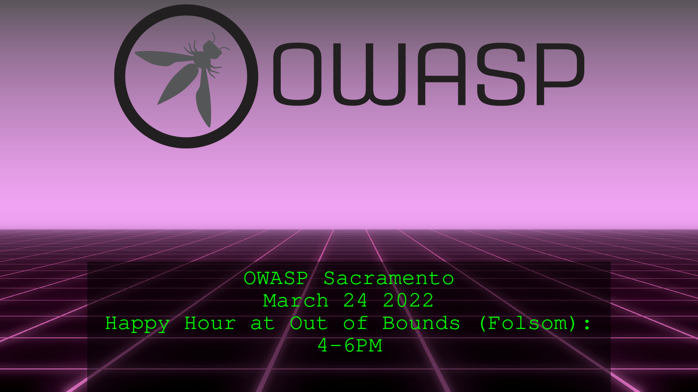
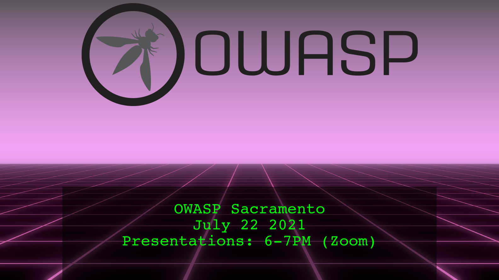
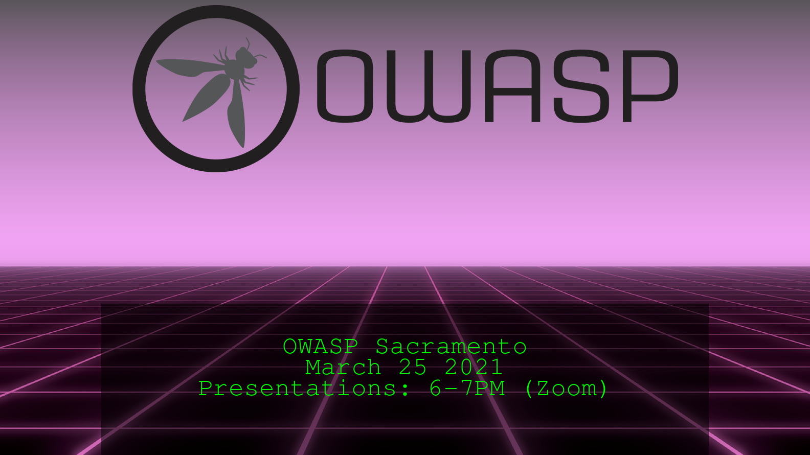
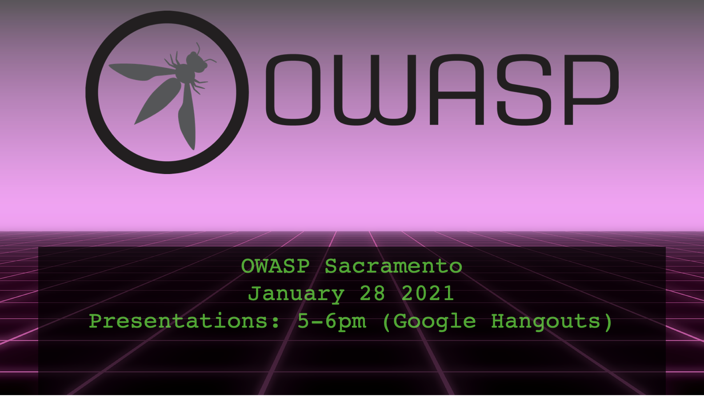

# Past Events

### March 2022  
  
No presentation/topic this month, it's just happy hour at Out of Bounds in Folsom!   

### February 2022  
  
Welcome to the first meetup of 2022!  
This month's presentation is a mock Red Team engagement within an insecurely configure TeamCity continuous integration environment.  
[Slides Source](assets/slides/2022-February.pptx)    
[Slides PDF](assets/slides/2022-February.pdf)  

### October 2021  
  
The holidays are fast approaching. This month we're hosting a virtual happy hour to get together and hangout before we're all busy with family and frineds. Come chat with us about the chapter, security in general, and let's get to know one another a bit better.

### August 2021
    
[Slides Source](assets/slides/2021-August.pptx)  
[Slides PDF](assets/slides/2021-August.pdf)  
This month Ryan Kozak presents a high leve overview of the Empire post-exploitation framework.

### July 2021
  
[Slides Source](assets/slides/2021-July.pptx)  
[Demo Repo](https://github.com/joubin/iac-demo)  
This month Joubin Jabbari covers AWS Security.  

### March 20201  
  
[Slide Desck](assets/slides/2021-mar.pptx)  
This month our presentation is on API security with Adam Fisher.  

### January 2021
 
[Slides Source](assets/slides/2021-jan.odp)  
[Slides PDF](assets/slides/2021-jan.pdf)  
This month Joubin Jabbari covers threat modeling with ThreatSpec, as well as OWASP's WebGoat project.  

### March 2020
  
[Slide Deck](assets/slides/2020-03-Sacramento-OWASP.pptx)  
This month we covered a simple intro into Threat Modeling. And we conducted this
meetup remotely due to the COVID-19 situation.  

### February 2020
  
[Slide Deck](assets/slides/20200221-intro-to-beef.pdf)  

This month we discussed how a tool like BeEF can reveal the true potential of
what Cross Site Scripting (XSS) can lead to. BeEF can be used to leverage
the exploitability of the browser to send payloads to unsuspecting victims.
Being aware of these attacks and how they work can help developers better
prepare and defend against them.

### January 2020
  
[Slide Deck](assets/slides/20200117-modern-web-security-patterns.pdf)  

BSides SF is fast approaching! Who's going?

This month we talked about a number of modern web security patterns. Like how to
add Subresource Integrity (SRI) checking to your external resources. Ways you
can enable Content Security Policies (CSP) and reporting on CSPs. What to expect
from Expect Certificate Transparency (Expect-CT) and Certificate Authorization
Authorities (CAAs). Then we wrapped it up with how to set up a `security.txt` on
your site with the securitytxt [proposal][1]. There's also a generator found
at https://securitytxt.org

### October 2019
  

Come join us for the inaugural event of the Sacramento OWASP Chapter. We have so
much AppSec, NetSec, and InfoSec talent in the Sacramento area that it’s time we
form a community for us to share our thoughts, experiences, and best practices.

The Sacramento OWASP chapter has been dormant for a while and it’s time to give
it a jump start. This will be our first official meeting. Come by, say hello,
put a face to a name, and maybe let us know what you’re interested in learning
or even contributing!

Please RSVP by October 15th so we can accommodate seating, snacks, and drinks.

[1]: https://tools.ietf.org/html/draft-foudil-securitytxt
