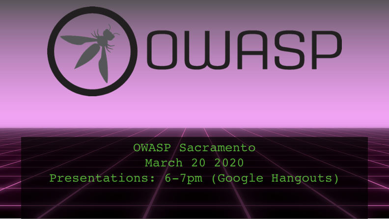
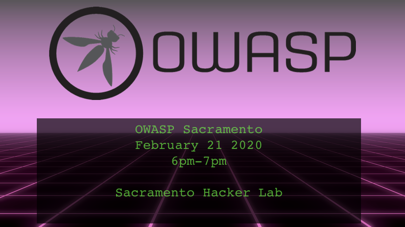
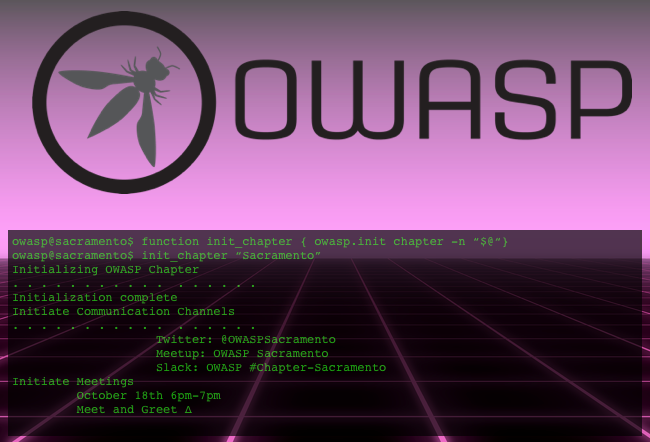

# Past Events

### March 2020

[Slide Deck](assets/slides/2020-03-Sacramento-OWASP.pptx)

This month we coved a simple into to Threat Modeling. We had to conduct this meeting remotly due to the COVID-19 situation. 

### February 2020

[Slide Deck][https://docs.google.com/presentation/d/1SB-6EhECfABgFx3KGoKrS5uKtFIWZxzrPA_iWya4Y3g/edit#slide=id.p1]

This month we discussed how a tool like BeEF can reveal the true potential of
what Cross Site Scripting (XSS) can lead to. BeEF can be used to leverage
the exploitability of the browser to send payloads to unsuspecting victims.
Being aware of these attacks and how they work can help developers better
prepare and defend against them.

### January 2020

[Slide Deck](assets/slides/20200117-modern-web-security-patterns.pdf)

BSides SF is fast approaching! Who's going?

This month we talked about a number of modern web security patterns. Like how to
add Subresource Integrity (SRI) checking to your external resources. Ways you
can enable Content Security Policies (CSP) and reporting on CSPs. What to expect
from Expect Certificate Transparency (Expect-CT) and Certificate Authorization
Authorities (CAAs). Then we wrapped it up with how to set up a `security.txt` on
your site with the securitytxt [proposal][1]. There's also a generator found
at https://securitytxt.org

### November 2019

Come join us for the inaugural event of the Sacramento OWASP Chapter. We have so
much AppSec, NetSec, and InfoSec talent in the Sacramento area that it’s time we
form a community for us to share our thoughts, experiences, and best practices.

The Sacramento OWASP chapter has been dormant for a while and it’s time to give
it a jump start. This will be our first official meeting. Come by, say hello,
put a face to a name, and maybe let us know what you’re interested in learning
or even contributing!

Please RSVP by October 15th so we can accommodate seating, snacks, and drinks.

[1]: https://tools.ietf.org/html/draft-foudil-securitytxt
